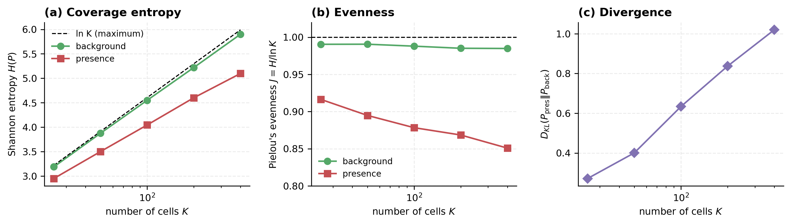
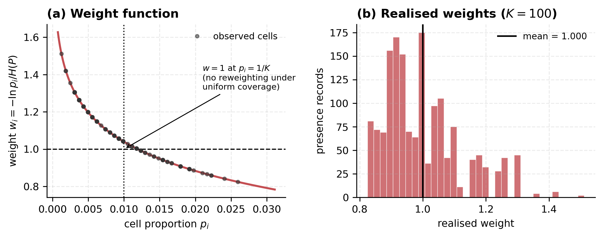
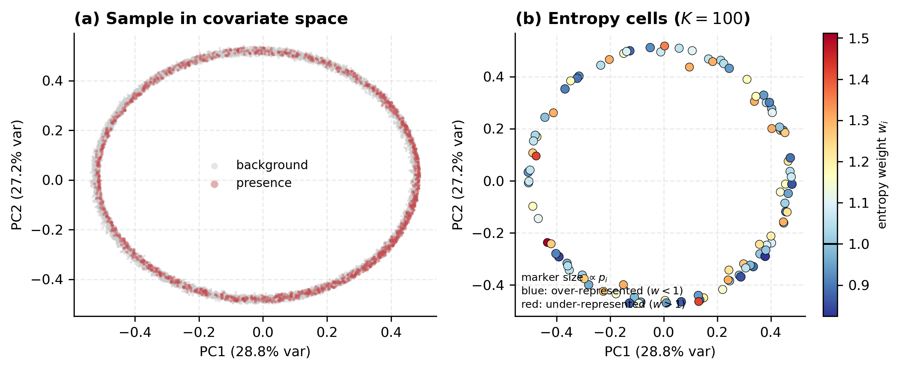
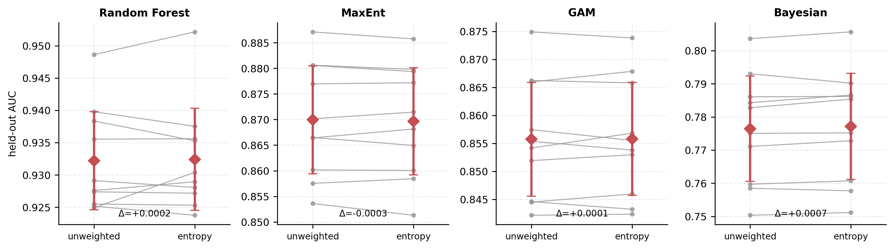
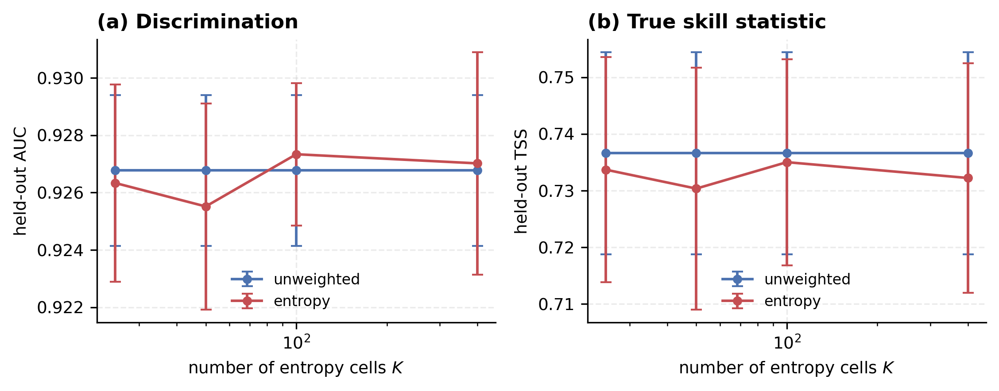
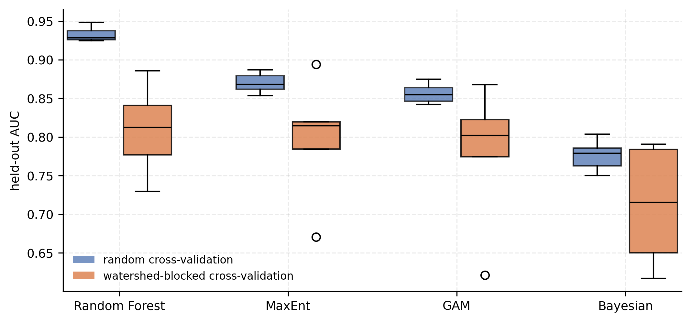
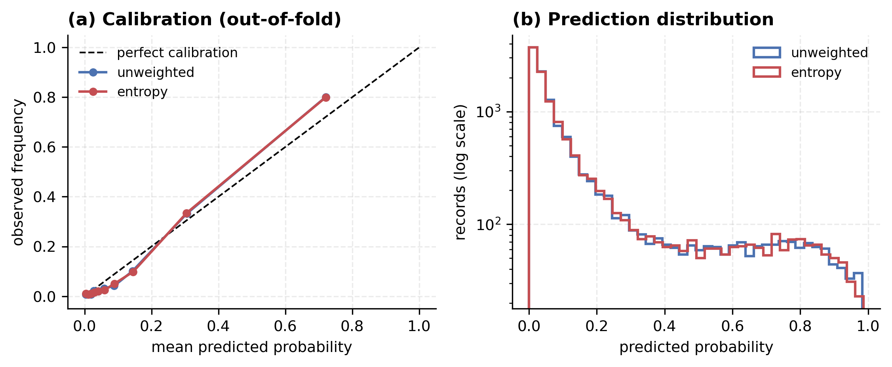
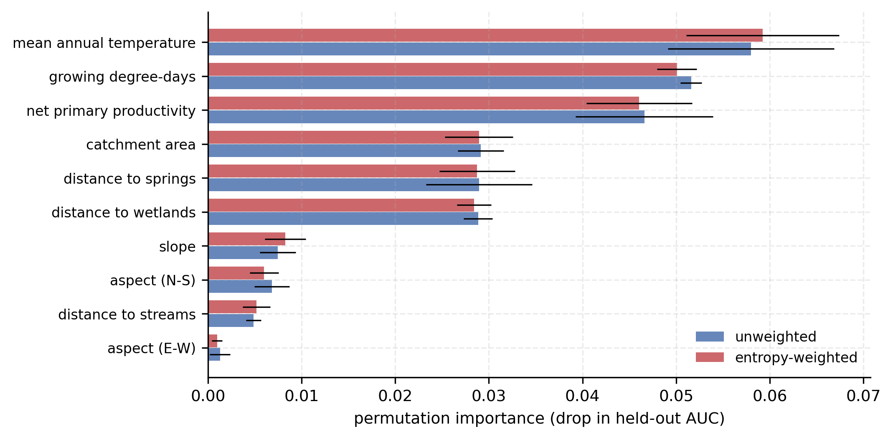
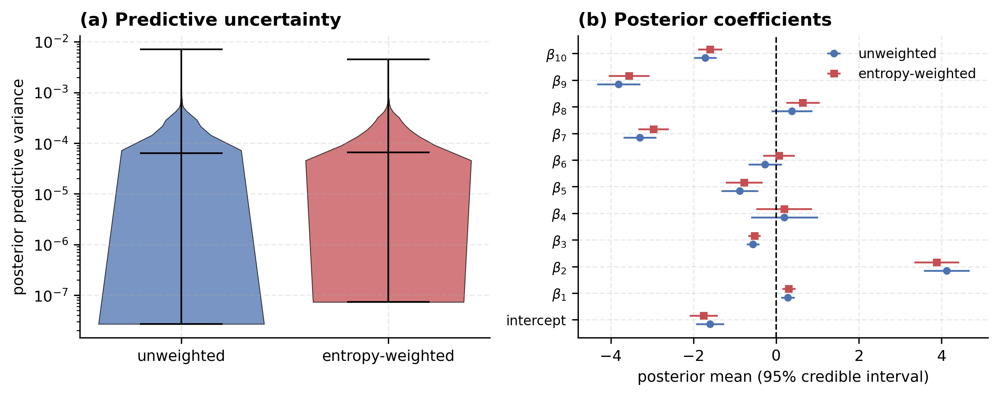

# Figures

Generated by `Entropy_Sampling_Bias.ipynb`. PDF for the manuscript, PNG so that
GitHub renders them below.

> The versions committed here come from the reference run recorded in the
> notebook output. Re-running the notebook overwrites them with figures from
> your own environment, which is what the manuscript should report.

### Coverage of covariate space: entropy, evenness and divergence across resolutions

### The weighting function and the distribution of realised weights

### Entropy cells located in a projection of the covariate space

### Fold-by-fold comparison, weighted against unweighted, all four frameworks

### Sensitivity of the result to the number of entropy cells

### Random against watershed-blocked cross-validation

### Out-of-fold calibration and prediction distribution

### Held-out permutation importance

### Posterior predictive variance and coefficient intervals

